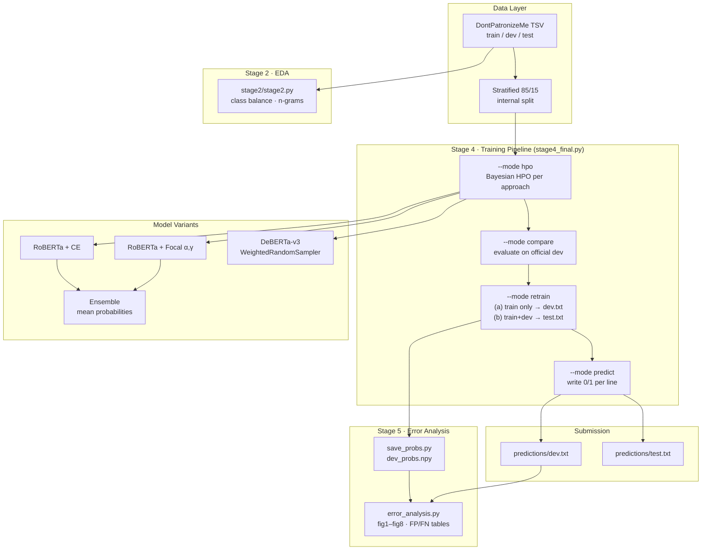

# Patronizing and Condescending Language Detection


> **SemEval-2022 Task 4, Subtask 1** — binary classification of whether a paragraph contains Patronizing and Condescending Language (PCL) toward a vulnerable group. Dataset: **DontPatronizeMe** (Pérez-Almendros et al., 2020).

---

## What This Project Does

An end-to-end NLP pipeline for detecting patronizing and condescending language in news paragraphs — built to navigate severe class imbalance (~9.5% positive) through loss-function diversity and probability-averaging ensembles.

**Core capabilities:**

- **Full training pipeline** — hyperparameter optimisation, fair model comparison on the held-out dev set, retrain-on-all-labels, and submission-format prediction, all orchestrated through a single CLI (`--mode hpo|compare|retrain|predict|all`)
- **Ensemble modelling** — two fine-tuned RoBERTa-base classifiers with complementary losses (cross-entropy + focal) combined by averaging output probabilities
- **Class-imbalance handling** — `WeightedRandomSampler` guarantees positive examples in every batch, fixing the batch-level collapse observed in earlier DeBERTa runs
- **Reproducible error analysis** — eight committed figures covering confusion matrix, PR curve, calibration, threshold sweep, category miss-rates, annotator-agreement effects, and length sensitivity
- **No-leakage dev predictions** — `dev.txt` is produced by a model trained on train-only; `test.txt` uses train+dev combined to maximise labelled data

---

## Results

| Model | Dev F1 | Precision | Recall |
|---|---|---|---|
| RoBERTa + cross-entropy | 0.5954 | 0.603 | 0.588 |
| RoBERTa + focal loss | 0.5948 | 0.557 | 0.638 |
| **Ensemble (mean probs)** | **0.5967** | 0.568 | 0.628 |
| DeBERTa-v3-base | 0.173 | 0.095 | 1.000 |

Averaging the two RoBERTa models balances their complementary biases — cross-entropy is more precise, focal loss is more sensitive — and achieves the best F1. DeBERTa collapsed to predicting all positives under severe class imbalance.

---

## Architecture



---

## Key Engineering Highlights

| Area | Detail |
|---|---|
| **Loss-function diversity** | Two RoBERTa-base classifiers trained with cross-entropy and focal loss (α=0.75, γ=2.0) produce complementary precision-recall profiles; averaging their softmax probabilities yields the best F1 |
| **Batch-level imbalance fix** | Batch size 8 with 9.5% positives meant ~45% of batches had zero positives — focal loss got no signal. Fix: `WeightedRandomSampler` forces positives in every batch, paired with standard CE to avoid double-weighting |
| **No-leakage protocol** | `dev.txt` is generated by a model trained on train only — dev labels are public and training on them would inflate scores. `test.txt` maximises labelled data by training on train+dev combined |
| **Threshold selection** | Thresholds are tuned on an internal 15% stratified holdout (for dev predictions) and the official dev set (for test predictions) rather than fixing at 0.5 — reflected in `stage5/fig6_threshold_curve.png` |
| **Reproducible error analysis** | Every figure in `stage5/` is regenerable from `predictions/dev.txt` + dataset + a committed `dev_probs.npy`. Calibration, PR-AUC, and category miss-rates are decoupled from the training code |
| **Single-script pipeline** | `stage4/stage4_final.py` exposes four modes (`hpo`, `compare`, `retrain`, `predict`) plus `all`. Each mode is idempotent and reads/writes JSON manifests (`comparison_results.json`, `final_config.json`) |
| **Hardware-agnostic installs** | `requirements.txt` pins CPU builds of torch; GPU users install torch from the CUDA 12.x wheel index before installing the rest, so the same file works on CI and on Azure A100s |

---

## Error Analysis Figures

All figures are pre-generated and committed under [`stage5/`](stage5/):

| Figure | File |
|---|---|
| Confusion matrix | [fig1_confusion_matrix.png](stage5/fig1_confusion_matrix.png) |
| Category miss rate | [fig2_category_miss_rate.png](stage5/fig2_category_miss_rate.png) |
| Annotator agreement vs. errors | [fig3_annotator_score.png](stage5/fig3_annotator_score.png) |
| Model comparison | [fig4_model_comparison.png](stage5/fig4_model_comparison.png) |
| Precision-recall curve | [fig5_pr_curve.png](stage5/fig5_pr_curve.png) |
| Threshold sweep | [fig6_threshold_curve.png](stage5/fig6_threshold_curve.png) |
| Calibration | [fig7_calibration.png](stage5/fig7_calibration.png) |
| Length vs. F1 | [fig8_length_curve.png](stage5/fig8_length_curve.png) |

False positive / false negative examples are in [`stage5/fp_cases.csv`](stage5/fp_cases.csv) and [`stage5/fn_cases.csv`](stage5/fn_cases.csv).

---

## Tech Stack

| Layer | Technology |
|---|---|
| Framework | PyTorch 2.6 |
| Models | HuggingFace Transformers — RoBERTa-base, DeBERTa-v3-base |
| Tokenisation | SentencePiece (DeBERTa), BPE (RoBERTa) |
| Metrics | scikit-learn (F1, precision/recall, confusion matrix) |
| Visualisation | matplotlib |
| Numerics | NumPy |

---

## Project Structure

```text
.
├── predictions/                   # Final submission files
│   ├── dev.txt                    # 2094 lines, trained on train only
│   └── test.txt                   # 3832 lines, trained on train+dev
├── BestModel/
│   └── best_model.ipynb           # Walkthrough notebook — start here
├── stage2/                        # Exploratory data analysis
│   ├── stage2.py
│   ├── eda_1_binary.png           # Class distribution
│   └── eda_2_train_ngrams.png     # N-gram frequencies
├── stage4/                        # Training pipeline
│   └── stage4_final.py            # hpo → compare → retrain → predict
├── stage5/                        # Error analysis
│   ├── error_analysis.py
│   ├── save_probs.py              # Regenerates dev_probs.npy (GPU required)
│   ├── dev_probs.npy              # Cached ensemble probabilities
│   ├── fig1–fig8 .png
│   ├── fp_cases.csv
│   └── fn_cases.csv
├── dataset/                       # Not committed — see "Dataset Setup" below
├── requirements.txt
└── README.md
```

---

## Dataset Setup

The DontPatronizeMe dataset is **not redistributed** in this repository. Request access from the task organisers (Pérez-Almendros et al.) and place the files as follows:

```text
dataset/train/data/dontpatronizeme_pcl.tsv
dataset/train/labels/train_semeval_parids-labels.csv
dataset/train/labels/dev_semeval_parids-labels.csv
dataset/test/data/task4_test.tsv
```

---

## Local Setup

```bash
# 1. Clone and enter the repo
git clone https://github.com/catalinatan/nlp.git
cd nlp

# 2. Create and activate a virtual environment
python -m venv .venv
source .venv/bin/activate          # Windows: .venv\Scripts\activate

# 3. Install dependencies
# GPU users (CUDA 12.x) — install torch first:
#   pip install torch --index-url https://download.pytorch.org/whl/cu124
pip install -r requirements.txt

# 4. Place the dataset files (see "Dataset Setup")
```

---

## Reproducing Results

The notebook [`BestModel/best_model.ipynb`](BestModel/best_model.ipynb) walks through every step end-to-end. Or run the pipeline directly:

```bash
# Full pipeline (HPO → compare → retrain → predict)
python stage4/stage4_final.py --mode all

# Or individual stages
python stage4/stage4_final.py --mode hpo --n_trials 5
python stage4/stage4_final.py --mode compare
python stage4/stage4_final.py --mode retrain
python stage4/stage4_final.py --mode predict
```

Predictions are written to `stage4/outputs_stage4/dev.txt` and `test.txt`, and mirrored to [`predictions/`](predictions/) for convenience.

**EDA figures:**

```bash
python stage2/stage2.py
```

**Error analysis figures** (all eight are committed; regenerate with):

```bash
python stage5/error_analysis.py
```

> `dev_probs.npy` is committed. To regenerate it, run `python stage5/save_probs.py` on a machine with GPU + the HPO checkpoints.

---

## Quickstart for Markers

Submission files are committed directly — no re-running required:

```text
predictions/dev.txt    # 2094 lines, one 0/1 per line
predictions/test.txt   # 3832 lines, one 0/1 per line
```

---

## Data Attribution

Dataset: **DontPatronizeMe** — Pérez-Almendros, Anke & Schockaert (2020). *"Don't Patronize Me! An Annotated Dataset with Patronizing and Condescending Language towards Vulnerable Communities."* COLING 2020.

Task: **SemEval-2022 Task 4** — Patronizing and Condescending Language Detection.
